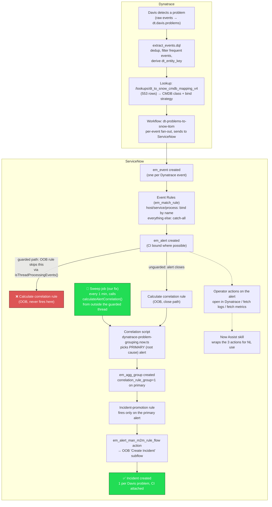

# Pipeline flow, end to end

How a Dynatrace Davis problem becomes a ServiceNow incident, and why the
correlation step needed a scheduled-job workaround. See `docs/USER-SETUP.md`
for the full known-issues inventory and `docs/superpowers/specs/2026-09-05-dynatrace-servicenow-aiops-design.md`
section 16 for measured pass/fail results per spec check.

## The key thing this diagram makes visible

There are two ways into correlation — the normal path (`H1`) is structurally
blocked by a ServiceNow platform guard (`AlertManager.isThreadProcessingEvents()`),
so nothing ever flowed through it on this instance: every alert this pipeline
creates is born inside the exact thread that guard excludes. The close path
(`H2`) worked once the correlation script's own bugs were fixed, but only for
alerts that actually closed. The sweep job (`SWEEP`, green,
`servicenow/src/fluent/correlation/dynatrace-correlation-sweep-job.now.ts`) is
what makes it work for *any* alert, on a 1-minute cadence, by calling the same
correlation logic from outside the blocked thread.

Confirmed live end to end: `INC0010001`, `INC0010002`, `INC0010003` — real
incidents created from real Dynatrace Davis problems, each with a bound CI.
