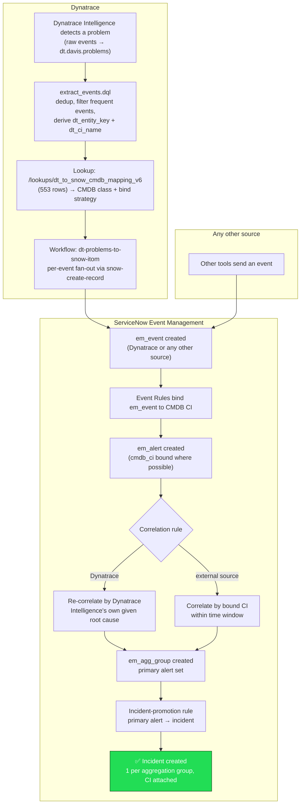

# Pipeline flow, end to end

How a Dynatrace Intelligence problem becomes a ServiceNow incident. See
`docs/USER-SETUP.md` for the full known-issues inventory and
`docs/superpowers/specs/2026-09-05-dynatrace-servicenow-aiops-design.md`
section 16 for measured pass/fail results per spec check.

This covers Event Management only: ingestion, CI binding, correlation, and
incident promotion. It intentionally leaves out three things that exist in
the codebase but aren't part of this picture yet: the ServiceNow-side
correlation-guard workaround (pending confirmation from the ServiceNow team
on whether the same platform guard applies to a customer's live AIOps Pro
environment), the operator-action subflows/Now Assist skill, and per-record
detail like the `kb_url` business rule.

A Dynatrace alert and another source's alert can even land in the *same*
aggregation group and the *same* incident, if they're bound to the same CI
within the correlation window — that cross-source correlation is the whole
point of keying grouping off `cmdb_ci` rather than anything Dynatrace-specific.

## Two correlation rules, not one

There are two correlation rules, evaluated in order, and the first one that
produces a result for a given alert wins:

1. **Dynatrace, by Dynatrace Intelligence's given root cause** — groups a
   Dynatrace alert with another still-groupable Dynatrace alert from the
   *same Dynatrace Intelligence problem*, preserving Dynatrace Intelligence's
   own topology-aware root-cause determination exactly, rather than
   re-deriving it from CMDB data. Runs first. Produces no result for a solo
   Dynatrace alert (no sibling from the same problem yet), so that alert
   falls through to rule 2.
2. **Any source, by bound CI** — groups any alert (Dynatrace or otherwise)
   sharing the same `cmdb_ci` within a time window. This is what lets a solo
   Dynatrace alert join a different source's alert on the same CI, and it's
   the only correlation path for every non-Dynatrace source.

Primary (the alert that gets promoted to an incident) is chosen by Dynatrace
Intelligence's own root-cause signal when present, falling back to severity
for every other source.

## What changed since the diagram was first drawn (2026-09-11 generalization)

The correlation rule, sweep job, and incident-promotion rule were each
widened from "Dynatrace only" to "any source with a bound CI":

- **Grouping key**: was `dt_problem_display_id` (parsed out of Dynatrace's own
  `additional_info` shape — unusable for any other source's alerts). Now it's
  `cmdb_ci`, a plain `em_alert` column every source populates identically once
  its own `em_match_rule` binds it.
- **Primary/root-cause ranking**: was Dynatrace Intelligence's
  `is_rootcause_relevant` flag alone. Now it's `dt_is_root_cause` first
  (Dynatrace-only bonus signal,
  parsed best-effort), falling back to `severity` (lower number = more
  severe; `severity=0`/Clear is normalized to the worst rank) for every other
  source.
- **Sweep job scope**: was `source=Dynatrace`. Now sweeps every source's
  ungrouped `Open`/`Reopen` alerts, since the platform guard it works around
  applies identically regardless of source.
- **Incident promotion**: was gated on `source=Dynatrace^correlation_rule_group=1`.
  Now just `correlation_rule_group=1^incidentISEMPTY` — any alert that reaches
  Primary, from any source, gets promoted.
- **Azure Monitor is deliberately excluded** from the generalized correlation
  rule (order 90 runs before Azure's own dedicated rule at order 9000, and the
  correlation engine stops at the first rule that produces a result) so its
  richer, tag-based correlation still runs unpreempted.
- **Lookup table**: the mapping now loads from
  `/lookups/dt_to_snow_cmdb_mapping_v6` (six versions exist total; the token
  can create new paths but not delete old ones, so `_v1`–`_v5` are inert
  rollback artifacts).
- **kb_url**: no longer set by a (dead) workflow field mapping to `em_event` —
  `em_event` has no `kb_url` column. A `sys_script` Business Rule on `em_alert`
  now parses `dt_problem_url` back out of `additional_info` at insert time.

Confirmed live end to end: `INC0010001`, `INC0010002`, `INC0010003` — real
incidents created from real Dynatrace Intelligence problems, each with a
bound CI.

## Root cause fix: dt_is_root_cause (2026-09-15)

Investigating problem `P-26092999` (two entities: `easytrade-broker-service`
and `easytrade-frontendreverseproxy`) found that Dynatrace Intelligence's
per-event flag, `dt.davis.is_rootcause_relevant`, is not exclusive — it came
back `true` on *both* events, so whichever alert happened to reach ServiceNow
last won PRIMARY, independent of what Dynatrace Intelligence actually
determined. The Dynatrace Intelligence problem record itself carries a
single authoritative field,
`root_cause_entity_id` — in this case `SERVICE-622C061A12638EE4`
(broker-service) — which the per-event extraction never looked at.

Fix: `extract_events.dql` (and the deployed workflow) now compute a new
field, `dt_is_root_cause = dt_entity_id == root_cause_entity_id`, comparing
each event's own entity against the problem's single root cause. Since only
one entity id can equal it, this is exclusive by construction. Both
correlation rules (order 85 and order 90) were updated to read this field
instead of the old per-event flag. (Originally shipped as
`dt_is_davis_root_cause`, then renamed to `dt_is_root_cause` to drop the
product-specific name.) This only affects events processed after the fix —
alerts already created from an earlier Dynatrace Intelligence event still carry the old flag
in their stored `additional_info` and won't retroactively correct.

While investigating this, a second, unrelated drift was found and folded
into the same fix: the live-deployed workflow had accumulated changes made
directly on the instance rather than through this repo — a team-scoped
trigger filter (`primary_tags.team == "agentic-aeric"`), a ±15-minute
`extract_events` query window (repo had ±5m), an extra `dt_entity_name`
fallback, and a disabled `fieldsKeep` step (so every field currently passes
through to `additional_info` unfiltered). All of that live state has been
folded back into `dynatrace/workflows/dt-problems-to-snow-itom.yaml` and
`dynatrace/dql/extract_events.dql` so the repo now matches what's actually
deployed, rather than reverting it.

## Two close-path bugs found and fixed (2026-09-15)

Investigating "why isn't this alert closing" on P-26092999 turned up two
distinct bugs, both from the same underlying mistake: trusting per-execution,
per-entity data that can be missing or momentarily stale, instead of the
workflow's own trigger event, which already carries reliable problem-level
truth.

1. **Regression from the `dt_is_root_cause` fix, same day.**
   `{{ event()['root_cause_entity_id'] }}` has no fallback. A single-entity
   problem (confirmed live: `P-26093008`) has no `root_cause_entity_id` field
   on its trigger event at all, so the reference throws "Undefined
   variables" and fails the entire `extract_events` task — meaning no event
   of any kind, including a close, reaches ServiceNow for that execution.
   Fixed with `| default('', true)`; an empty string can never equal a real
   `dt_entity_id`, so `dt_is_root_cause` safely evaluates to `false` instead
   of crashing.

2. **A live race on the actual reference alert.** Broker-service's own
   underlying Dynatrace Intelligence event flipped `ACTIVE` → `CLOSED` in Grail at
   23:51:34.727. The workflow's close-triggered execution started at
   23:51:34.795 — 68ms later — and its `extract_events` re-fetch of that
   entity's own event status landed on a stale `ACTIVE` snapshot instead
   (Grail write-then-read visibility isn't guaranteed at that timescale), so
   severity 2 went out instead of 0 and the close was silently dropped for
   that one entity. It then likely sat idle long enough to be auto-closed by
   ServiceNow's own idle-alert threshold job, and the same stale, wrongly
   non-zero-severity event reopened it once it finally arrived — which is
   why the alert showed `Reopen`, not just stuck `Open`. Fixed by changing
   the severity mapping from each item's own re-queried
   `_.item["event.status"]` to the trigger's own `event()["event.status"]`:
   since a close-triggered execution IS the close, every event extracted in
   that batch should resolve together, with no per-entity re-query needed at
   all.

Both fixes are applied to the live workflow and folded into the repo copies.
Neither retroactively fixes alerts already stuck from before the fix —
`P-26092999`'s broker-service alert specifically will need a manual close or
a fresh Dynatrace Intelligence transition on that problem to clear.
